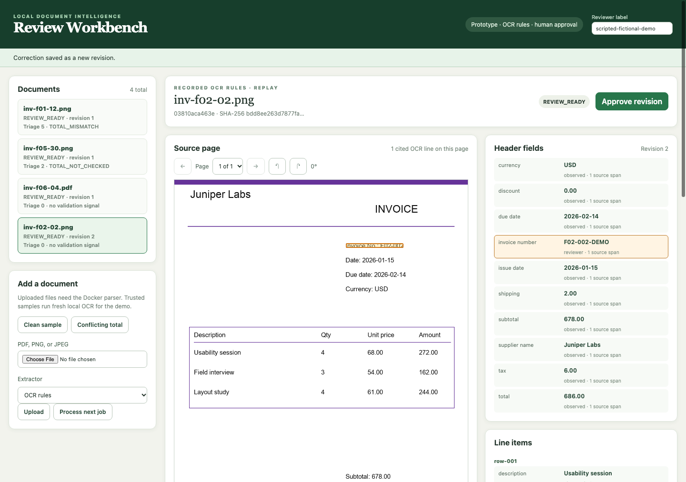

# Local Document Intelligence & Review Workbench

A local invoice application that extracts structured fields and rows, links suggestions to page evidence, and exports JSON/CSV only after human approval. Corrections create auditable revisions; approvals and export bytes belong to an exact revision. Uploaded PDFs and images run through an isolated Docker parser, with an optional pinned local language model.

**Status: experimental portfolio release candidate with a completed six-case author pilot.** The upload/review/export workflow, parser recovery, portable backups, and complete 180-invoice/100-receipt paired comparisons are implemented and recorded. The local model regresses against rules on synthetic invoice headers and exact rows, so rules remain the default. The [author results](evals/author-review-pilot-2026-10-03-results.html) retain two errors in approved records; approval does not establish correctness. Separate [corrected drafts](docs/post-pilot-corrections.md) fix those values without changing the study. A [captioned demo](evals/portfolio-candidate-browser-2026-10-03/index.html) shows the review workflow using saved OCR on fictional cases.

Start with the [portfolio overview](docs/portfolio-candidate.md), [standalone comparison](evals/release-comparison-2026-10-03.html), [completed release audit](evals/portfolio-release-audit-2026-10-03-v2/index.html), and [runbook](docs/portfolio-release.md). The [system card](docs/system-card.md) and [data card](docs/data-card.md) bound the claims; the [architecture plan](arch_plan/document-intelligence-workbench-plan.md) records the broader original design.



*Automated Chrome capture on a disposable fictional development fixture using recorded OCR. This is interface evidence, not human review-time or live extraction evidence.*

## Why this project

The engineering question is whether a measured extraction pipeline can make document errors easier to find and correct. The default is conventional OCR and deterministic rules; a local span model is an explicit comparison. The product preserves printed values when arithmetic conflicts, exposes evidence limits, and requires review even when validation finds no issue.

The implementation emphasizes the boundaries around AI output:

- **Inspectability:** canonical page/span references, page navigation, line highlights, and distinct observed/computed/reviewer values.
- **State integrity:** immutable candidate revisions, stale-edit protection, current-revision approval, and hash-verified exports.
- **Isolation and recovery:** bounded network-denied parsing, renewable leases and fencing, verified OCR checkpoints, explicit retries, and portable restoration.
- **Measurement:** split-isolated corpora, frozen settings, all-document failure accounting, duplicate-aware row matching, paired uncertainty, and explicit rejection of a regressing extraction experiment.

The current stack is Python 3.12 standard-library HTTP/SQLite, HTML/CSS/JavaScript, Docker, Poppler/Tesseract, and optional native llama.cpp. It is a loopback single-user prototype with audit labels, not an authenticated multi-user application. Model assets and public receipt data are downloaded only through explicit setup commands. See [trust boundaries and limits](docs/system-card.md).

## Measured evidence

| Evidence | Recorded result | Scope |
|---|---|---|
| [Frozen default invoice baseline](docs/invoice-heldout-run.md) | 180/180 test invoices; header macro F1 **0.9981**; required fields exact **163/166** eligible documents; exact-row F1 **0.9423** | Self-authored held-out families, trusted PNG previews; excludes production PDF parsing |
| [Held-out invoice model comparison](docs/heldout-model-comparison.md) | All 180 accounted for; 176 records, four failures; model header F1 **0.9766**, exact-row F1 **0.7985**; regression gate rejects promotion | Same saved OCR as rules; failures remain scored; paired uncertainty and family results published |
| [Spatial extraction experiment](docs/spatial-extraction.md) | Rejected: calibration exact-row F1 falls from 0.8321 to 0.7863 | Default stays `ocr_rules` v0.3; improved development scores did not justify promotion |
| [Current local-model HTTP workflow](docs/real-model-upload.md#candidate-source-refresh) | Both PNGs pass upload, correction, approval and downloads; **66.929/57.557 s** | Pinned Qwen3 4B / llama.cpp on Apple M1; two fictional fixtures, not controlled warm latency |
| [Candidate parser checks](evals/portfolio-candidate-parser-2026-10-03-v2/report.json) | All **16** Docker checks pass after rebuilding a stale image | Timeout/OOM, checkpoint recovery, backup restoration and exports; failed first attempt retained |
| [Held-out CORD comparison](docs/heldout-model-comparison.md#receipt-comparison-and-scope) | 100 cases per variant; rules/model total F1 **0.2435/0.1651**, eligible exact-row F1 **0.0957/0.0204** | Separate receipt adapter and label masks; five model failures; both variants expose a large domain gap |
| [Author review pilot](docs/review-pilot.md) | **6/6** completed; active median **62.459 s**; required fields exact **5/6**; exact rows **19/20** | One author, synthetic development cases, recorded OCR, five edits and one acknowledgment; two residual errors; no time-saved claim |
| [Browser pilot controls](docs/review-pilot.md#verify-the-interface) | Automated Chrome check passes | Source highlight, pause/resume, approval, export, completion; separate from human results |
| [Browser workflow and recording](docs/browser-verification.md) | 15 Chrome checks pass; captioned WebM decodes and plays | Keyboard, rotation/highlight alignment, page navigation, revisions, verified downloads; scripted saved-OCR demonstration |
| [Offline portfolio replay](docs/demo-replay.md#recorded-checks) | **16** refreshed Chrome controls; clean-source preparation | Four recorded development cases, Python-only entrypoint, real review/export, explicit replay provenance |
| [Bounded production parser queue](docs/parser-queue.md) | 20/20 review-ready; 24 pages in **41.799 s**; worker P50/P95 **1.794/3.412 s** | Historical serial Docker OCR/rules on development originals; declared concurrent model load was unverified |

Synthetic invoice results cannot establish real vendor accuracy. Valid span IDs and substring alignment do not prove semantic evidence accuracy. Model stage timings on saved OCR exclude new parsing and human review. No time-saved or unattended-approval claim is made. See the cards and complete run reports for denominators, representative failures, hardware, and limitations.

## Try the portfolio demo

With Python 3.12, run this from the repository root:

```sh
make demo-replay
```

Open the session URL printed in the terminal. This offline demo needs no Docker, Tesseract, model weights, Python packages, or downloads. Four fictional development invoices replay recorded OCR/rules candidates: a clean invoice, a printed-total conflict, a low-contrast scan with an extraction error, and a two-page invoice. Select a case, inspect its source highlights, correct or acknowledge issues, approve, and download JSON/CSV. Replay is labeled in the interface and exported provenance; the demo does not measure extraction quality, live latency, or human productivity.

Each launch creates a separate workbench under `artifacts/demo-replay/`. Reviews and exports remain there after Ctrl+C; another launch starts fresh. See the [replay guide](docs/demo-replay.md) for the walkthrough and offline verification. For live OCR and uploads, use the commands below.

## Run locally

From the repository root, with Python 3.12:

```sh
make test
make eval-verify-corpus
```

These deterministic/offline checks need no Docker, OCR installation, model, or downloads. To run the browser with fresh trusted-sample OCR, install Tesseract with English language data, then:

```sh
make doctor
make smoke-ocr
make dev
```

Open the one-time URL printed by the server. Choose **Clean sample** or **Conflicting total**, inspect evidence, correct or acknowledge issues with a reason, approve, and export. Sample buttons run host OCR on trusted fixtures. For uploaded PDF/PNG/JPEG files, start Docker Desktop and run `make parser-build`; uploaded originals are processed only by the fixed parser image.

For the pinned Apple Silicon model, follow [explicit model setup](docs/intake.md#pinned-local-model-evaluation), then `make models-verify` and `make dev-model`. The server owns model credentials. Missing assets fail startup; they are never downloaded implicitly. Run one model workload at a time while held-out inference is active.

```sh
make evaluation-status
make release-check OUTPUT=artifacts/portfolio-audit-001
make release-checkout REF=HEAD OUTPUT=artifacts/checkout-commit-001
```

`release-check` writes standalone HTML, a hash-bound JSON snapshot, and a fresh deterministic test log. Exit 1 means pending evidence; exit 2 means invalid evidence; exit 0 means this checklist's supplied evidence is complete, subject to manual content review and the broader architecture acceptance criteria. Always use a new output directory. See [fresh checkout and demo instructions](docs/portfolio-release.md).

`release-checkout REF=HEAD` runs eight offline checks against the exact committed Git tree in a temporary directory, including restoration and rescoring of the completed author-pilot archive. Omit `REF` for a precommit check of current changes. Reports bind the commit/tree, copied inputs and command logs; CI runs the committed-tree check. This checks packaging and saved evidence, rather than new human review or inference. See [commit/tag verification](docs/portfolio-release.md#verify-an-exact-commit-or-tag).

`make evaluation-status` verifies completed prediction hashes and reports the frozen schedule, remaining work, failure types, and provisional model-stage timing estimates. Add `INSPECT_RUNNER=1` to check the recorded coordinator's process identity without printing its command line. This progress view does not audit quality or infer model health from a live coordinator. See [evaluation monitoring](docs/release-evaluation.md).

The offline demo and invoice/model-workflow/author-pilot audits need no CORD downloads. Full receipt rescoring and its release-audit check require [explicit CORD preparation](docs/release-evaluation.md#cord-receipt-evaluation); absent local source data remains pending. The [release packaging check](evals/portfolio-release-checkout-2026-10-03/report.json) verifies eight offline commands without copying local runtime assets or receipt images. The [earlier six-command check](evals/portfolio-candidate-checkout-2026-10-03/report.json) remains historical.

## Implementation and evaluation guides

| Topic | Guide |
|---|---|
| Intake, quotas, reconciliation, backups | [Local intake](docs/intake.md) |
| Revisions, issue decisions, priority, approvals, exports | [Review workflow](docs/review.md) |
| Evidence overlays, rotations, session boundary | [Browser prototype](docs/browser.md) |
| Parser checkpoints and host worker recovery | [Parser recovery](docs/parser-recovery.md) |
| Container policy and real runtime checks | [Parser verification](docs/parser-verification.md), [resource drills](docs/parser-resources.md) |
| Corpus, development, calibration, held-out baseline | [Invoice corpus](docs/invoice-corpus.md), [development](docs/invoice-development-run.md), [calibration](docs/invoice-calibration-run.md), [test](docs/invoice-heldout-run.md) |
| Frozen scoring, invoice/model and CORD comparisons | [Release evaluation](docs/release-evaluation.md) |
| Pinned-model feasibility and initial spike | [Development baseline](docs/development-baseline.md), [Phase 0 history](docs/phase0.md) |
| Real model through uploaded documents | [Model workflow](docs/real-model-upload.md) |
| Assisted author study and limitations | [Review pilot](docs/review-pilot.md) |
| Browser geometry, keyboard controls, and captioned demo | [Browser verification](docs/browser-verification.md) |
| Release audit, recording script, remaining work | [Portfolio release](docs/portfolio-release.md) |

Fresh experiments write to ignored `artifacts/`; committed `evals/` preserve recorded evidence. The original reports are historical measurements, not claims that every later source revision was tested with their runtime. The release audit reports that distinction explicitly.
