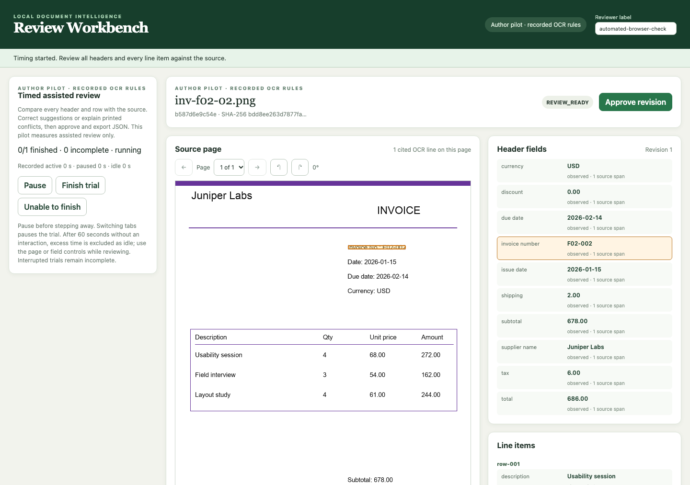

# Local Document Intelligence & Review Workbench

A local invoice application that extracts structured fields and rows, links suggestions to page evidence, and exports JSON/CSV only after human approval. Corrections create auditable revisions; approvals and export bytes belong to an exact revision. Uploaded PDFs and images run through an isolated Docker parser, with an optional pinned local language model.

**Status: experimental; portfolio release evidence is being completed.** The upload/review/export workflow, parser recovery, and portable backups are implemented. Full held-out model comparisons, the author review pilot, and a presentation recording remain pending. [`release-check`](docs/portfolio-release.md#generate-the-release-audit) runs fresh contracts and makes missing, changed, and complete evidence visible without scoring partial inference.

Start with the [portfolio runbook](docs/portfolio-release.md), [system card](docs/system-card.md), and [data card](docs/data-card.md). The [architecture plan](arch_plan/document-intelligence-workbench-plan.md) records the original design and broader acceptance criteria.



*Recorded automated Chrome check on a disposable fictional development fixture. This is interface evidence, not human review-time evidence.*

## Why this project

The engineering question is whether a measured extraction pipeline can make document errors easier to find and correct. The default is conventional OCR and deterministic rules; a local span model is an explicit comparison. The product preserves printed values when arithmetic conflicts, exposes evidence limits, and requires review even when validation finds no issue.

The implementation emphasizes the boundaries around AI output:

- **Inspectability:** canonical page/span references, page navigation, line highlights, and distinct observed/computed/reviewer values.
- **State integrity:** immutable candidate revisions, stale-edit protection, current-revision approval, and hash-verified exports.
- **Isolation and recovery:** bounded network-denied parsing, renewable leases and fencing, verified OCR checkpoints, explicit retries, and portable restoration.
- **Measurement:** split-isolated corpora, frozen settings, all-document failure accounting, duplicate-aware row matching, paired uncertainty, and explicit rejection of a regressing extraction experiment.

The current stack is Python 3.12 standard-library HTTP/SQLite, HTML/CSS/JavaScript, Docker, Poppler/Tesseract, and optional native llama.cpp. It is a loopback single-user prototype with audit labels, not an authenticated multi-user application. Model assets and public receipt data are downloaded only through explicit setup commands. See [trust boundaries and limits](docs/system-card.md).

## Measured evidence

| Evidence | Recorded result | Scope |
|---|---|---|
| [Frozen default invoice baseline](docs/invoice-heldout-run.md) | 180/180 test invoices; header macro F1 **0.9981**; required fields exact **163/166** eligible documents; exact-row F1 **0.9423** | Self-authored held-out families, trusted PNG previews; excludes production PDF parsing |
| [Spatial extraction experiment](docs/spatial-extraction.md) | Rejected: calibration exact-row F1 falls from 0.8321 to 0.7863 | Default stays `ocr_rules` v0.3; improved development scores did not justify promotion |
| [Real local-model HTTP workflow](docs/real-model-upload.md) | Both fictional PNGs pass upload, evidence checks, correction, approval, and downloads | Pinned Qwen3 4B / llama.cpp on Apple M1; historical source snapshot, two fixtures |
| [Parser resource/recovery checks](docs/parser-resources.md) | 16 recorded Docker checks pass | Timeout/OOM probes, checkpoint recovery, backup restoration, and review/export fixtures; source freshness checked separately |
| [CORD rules validation](evals/cord-validation-2026-10-03/ocr-rules/report.json) | 100/100 receipts; total F1 **0.1273**, eligible exact-row F1 **0.0774** | Separate public-receipt domain; exposes a large gap for this English OCR prototype |
| [Browser pilot controls](docs/review-pilot.md) | Automated Chrome check passes | Source highlight, pause/resume, approval, export, completion; human results pending |

Synthetic invoice results cannot establish real vendor accuracy. Valid span IDs and substring alignment do not prove semantic evidence accuracy. Model stage timings on saved OCR exclude new parsing and human review. No time-saved or unattended-approval claim is made. See the cards and complete run reports for denominators, representative failures, hardware, and limitations.

## Run locally

From the repository root, with Python 3.12:

```sh
make test
make eval-verify-corpus
```

These deterministic/offline checks need no Docker, OCR installation, model, or downloads. To run the browser with fresh trusted-sample OCR, install Tesseract with English language data, then:

```sh
make doctor
make smoke-ocr
make dev
```

Open the one-time URL printed by the server. Choose **Clean sample** or **Conflicting total**, inspect evidence, correct or acknowledge issues with a reason, approve, and export. Sample buttons run host OCR on trusted fixtures. For uploaded PDF/PNG/JPEG files, start Docker Desktop and run `make parser-build`; uploaded originals are processed only by the fixed parser image.

For the pinned Apple Silicon model, follow [explicit model setup](docs/intake.md#pinned-local-model-evaluation), then `make models-verify` and `make dev-model`. The server owns model credentials. Missing assets fail startup; they are never downloaded implicitly. Run one model workload at a time while held-out inference is active.

```sh
python3.12 scripts/evaluation_status.py
make release-check OUTPUT=artifacts/portfolio-audit-001
```

`release-check` writes standalone HTML, a hash-bound JSON snapshot, and a fresh deterministic test log. Exit 1 means pending evidence; exit 2 means invalid evidence; exit 0 means this checklist's supplied evidence is complete, subject to manual content review and the broader architecture acceptance criteria. Always use a new output directory. See [fresh checkout and demo instructions](docs/portfolio-release.md).

## Implementation and evaluation guides

| Topic | Guide |
|---|---|
| Intake, quotas, reconciliation, backups | [Local intake](docs/intake.md) |
| Revisions, issue decisions, priority, approvals, exports | [Review workflow](docs/review.md) |
| Evidence overlays, rotations, session boundary | [Browser prototype](docs/browser.md) |
| Parser checkpoints and host worker recovery | [Parser recovery](docs/parser-recovery.md) |
| Container policy and real runtime checks | [Parser verification](docs/parser-verification.md), [resource drills](docs/parser-resources.md) |
| Corpus, development, calibration, held-out baseline | [Invoice corpus](docs/invoice-corpus.md), [development](docs/invoice-development-run.md), [calibration](docs/invoice-calibration-run.md), [test](docs/invoice-heldout-run.md) |
| Frozen scoring, invoice/model and CORD comparisons | [Release evaluation](docs/release-evaluation.md) |
| Pinned-model feasibility and initial spike | [Development baseline](docs/development-baseline.md), [Phase 0 history](docs/phase0.md) |
| Real model through uploaded documents | [Model workflow](docs/real-model-upload.md) |
| Assisted author study and limitations | [Review pilot](docs/review-pilot.md) |
| Release audit, recording script, remaining work | [Portfolio release](docs/portfolio-release.md) |

Fresh experiments write to ignored `artifacts/`; committed `evals/` preserve recorded evidence. The original reports are historical measurements, not claims that every later source revision was tested with their runtime. The release audit reports that distinction explicitly.
