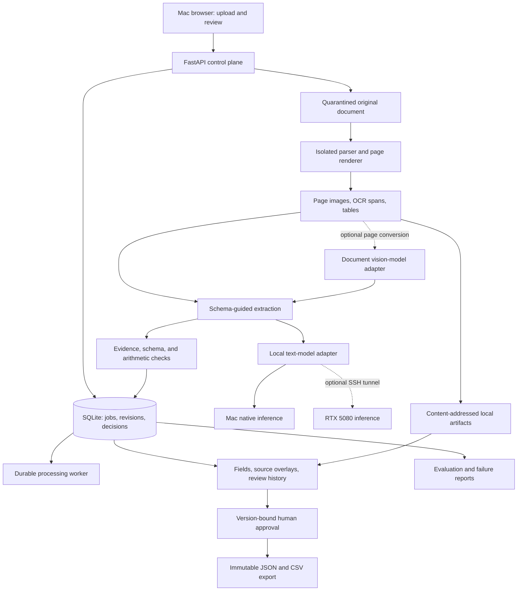

# Local Document Intelligence & Review Workbench

## 1. Executive summary

Build a local application that turns invoice PDFs and scans into structured records with inspectable evidence. The reviewer sees the original page beside extracted header fields and line items, selects a field to highlight its source, corrects uncertain values, and approves a versioned JSON/CSV export.

The engineering question is: **Can a measured extraction and review pipeline reduce manual document work while making its errors easy to locate and correct?** Compare conventional OCR and deterministic parsing with layout-aware extraction plus a local language model. A document vision model is an optional third variant, evaluated before adoption.

The project adds multimodal processing, structured data extraction, human review, and a visible business workflow to the existing portfolio. It follows the Secure Agent Platform in implementation order. The Mac owns the application and data; the RTX 5080 PC can provide optional inference acceleration. No hosted OCR, paid model API, cloud storage, or persistent cloud deployment is required.

**Planning status:** design only, September 23, 2026. Commands and thresholds below are intended interfaces and proposed objectives. No extraction quality, latency, or review-time improvement has been measured yet. Mac chip/RAM and PC OS must be recorded in the implementation preflight.

### Goals

- Process bounded invoice PDFs, PNGs, and JPEGs into validated header fields and line items.
- Preserve page/span provenance and distinguish observed values from computed values or reviewer corrections.
- Surface uncertainty, missing fields, conflicting amounts, and duplicate candidates for review.
- Make edits, approvals, and exports versioned, auditable, and recoverable across restarts.
- Measure field quality, line-item quality, evidence accuracy, review workload, memory, and latency.
- Provide a Mac demo, an optional PC model profile, deterministic CI, and reproducible real-model reports.

### Non-goals for the first release

- Payments, bank-account verification, ERP integration, tax advice, or financial decision automation.
- Automatic approval or unattended export of model-generated records.
- Purchase-order matching, handwriting, arbitrary document classes, and general document chat.
- Training a foundation model, fine-tuning, active learning from reviewer edits, or a hosted SaaS service.
- Kubernetes, distributed queues, enterprise multi-tenancy, and cloud infrastructure.

## 2. User experience and workflow

### Engineer workflow

1. Run hardware/runtime preflight and explicitly download pinned OCR/layout and language-model assets.
2. Start the local application and seed fictional sample invoices.
3. Upload a bounded document batch. Monitor queued, processing, review-ready, and failed counts.
4. Review the side-by-side page and fields, resolve flagged issues, approve, and export.
5. Run a frozen evaluation split and publish comparisons with the baseline.

Proposed commands: `make doctor`, `make models-fetch`, `make dev`, `docwork ingest ./samples`, `docwork eval run --preset smoke`, and `docwork eval report <run_id>`. `make demo-replay` renders recorded extraction results without a model and labels them as replay. These commands will be implemented in the phases below.

### Reviewer workflow

The demo uses three fictional invoices: a clean invoice, a degraded scan, and an invoice with a conflicting total. The reviewer opens a document, clicks the invoice number or line-item amount to view its source box, corrects an OCR error, resolves the total warning, approves the current revision, and downloads its export.

UI screens: document queue; page/field review workspace; validation issues; version history; benchmark comparison. Use server-rendered page images with overlays, keyboard navigation, and a clear distinction between model suggestions and approved values. Source evidence remains visible after correction.

### Document and review lifecycle

```text
RECEIVED -> VALIDATING -> PARSING -> EXTRACTING -> CHECKING -> REVIEW_READY
                |            |           |                     |
                +------------+-----------+-> FAILED             +-> APPROVED
                +-> REJECTED                                     |
                                                                +-> EXPORT_READY
```

`CANCELLED` is available during processing. Editing an approved record creates a new revision in `REVIEW_READY`; the old approval remains historical and cannot authorize the new export. A previously exported artifact stays immutable and identifies its approved revision. Deleting a document removes application-held artifacts through a tracked deletion job; it cannot retract exports already downloaded elsewhere.

## 3. System architecture

### 3.1 Components and data flow



| Component | Implementation choice | Responsibility |
|---|---|---|
| API and CLI | Python 3.12, FastAPI, Pydantic v2, Typer | Uploads, job control, review, export, evaluations |
| Persistence | SQLite WAL and local artifact directory | Single-node queue, document/revision metadata, evidence, audit |
| Parser supervisor | Trusted host process with fixed container entrypoint | Resource-limited PDF/image parsing, sanitized outputs |
| OCR/layout pipeline | Docling standard pipeline, initially CPU | Text, layout, tables, page provenance |
| Baseline parser | Same pinned OCR source plus deterministic field/row rules | Comparable conventional baseline |
| Structured extractor | Local quantized text model with schema validation | Map spans/table rows into invoice fields |
| Optional VLM converter | Granite-Docling candidate behind a separate adapter | Compare page-to-document conversion with standard OCR/layout |
| Validation engine | Typed Python rules, Decimal arithmetic | Evidence verification, type checks, arithmetic conflicts |
| Review UI | React, TypeScript, Vite | Page overlays, field edits, warnings, approval and history |
| Evaluation | Python library and CLI | Field/row metrics, review selection, robustness, reports |
| Telemetry | JSON/OpenTelemetry; optional Grafana stack | Queue and stage health, performance, errors |

### 3.2 Ingestion and parser isolation

Initial limits: 20 MB per file, 10 pages per document, 20 files per batch, and 20 megapixels per decoded image/page. Accept PDF/PNG/JPEG only; check signatures as well as MIME/extension. Reject encrypted PDFs, malformed inputs, unsupported formats, and limit violations with an explicit reason. Filenames are display metadata, never filesystem paths.

Stream uploads to a temporary quarantined file while counting bytes; compute a content hash and atomically move to object storage on local disk. Store duplicate-content relationships without silently merging separate submissions or approvals. A separate hash-based duplicate warning can be extended to invoice-number/vendor matches, but these remain review suggestions.

Parse originals in a fixed unprivileged container with no network, read-only weights/root filesystem, a per-job input mount, a bounded output directory, dropped capabilities, memory/CPU/PID limits, and a timeout. The tool receives no database, user home, inference token, or container-engine socket. The trusted supervisor verifies output paths, sizes, schemas, checksums, and symlinks before importing them. Each job's scratch directory is removed after import or failure.

Default OCR/layout runs on CPU inside this boundary. Native GPU conversion, when enabled, receives only bounded, re-encoded page images from the parser; it does not ingest arbitrary original PDFs. Image decoding still has an attack surface, so pixel limits and pinned dependencies remain necessary.

### 3.3 Canonical page and evidence representation

Normalize parser output into `DocumentPage`, `TextSpan`, `Table`, `TableCell`, and `EvidenceRef` objects. Every span has an immutable ID, page number, raw text, normalized text, extraction method, and bounding polygon when available. OCR confidence is optional and provider-specific.

Canonical display coordinates use normalized `[0,1]` values with a top-left origin on the displayed, rotation-corrected page. Preserve original page dimensions, original coordinate system, render scale, crop, deskew, and rotation transforms. Apply the same transform to overlays. Test known boxes on rotated, cropped, and scanned pages; never assume OCR pixels and PDF points share a coordinate system.

The extractor cites span/cell IDs. The server resolves their geometry; the model cannot invent trusted bounding boxes. A valid reference proves that a span exists, not that it supports the proposed value. Verification checks normalized string/value alignment and records ambiguity. Where conversion loses exact geometry, label evidence `approximate` or `unavailable` and require review. Do not manufacture precise highlights for VLM output.

### 3.4 Extraction variants

| Variant | Pipeline | Question answered |
|---|---|---|
| `ocr_rules` | Pinned OCR/native text, deterministic field and row rules | How much does a simple baseline solve? |
| `layout_llm` | Docling standard layout/table output, local structured extractor | Does layout context plus a small model improve field/row quality? |
| `vlm_llm` | Optional document VLM conversion, same downstream text extractor/validator | Does changing document conversion improve difficult pages? |

Keep downstream prompts and validation identical between the latter two where possible; report any representation differences. Compare paired documents and use a fixed model/profile for extraction. A separate oracle-text diagnostic may consume gold OCR to isolate recognition from parsing, but must be labeled and excluded from end-to-end scores.

Header fields: supplier name, invoice number, issue date, due date, currency, subtotal, tax, discount, shipping, and total. Line items: description, quantity, unit price, tax if explicitly present, and line total. Missing/ambiguous values are nullable with reasons. Invoice and receipt adapters have separate schemas and metric eligibility masks; unavailable receipt labels are not fabricated into invoice ground truth.

Chunk by page/table when the document exceeds the model context. Extract headers and rows separately, merge repeated headers deterministically, and retain unresolved conflicts. Stable row IDs preserve source order and page references. Repeated line descriptions remain separate records. Context overflow or incomplete coverage is an explicit review issue.

### 3.5 Validation and review prioritization

Use Decimal values serialized as strings. Preserve raw strings and apply versioned locale-specific parsers; ambiguous dates, currency symbols, decimal separators, or currency absence generate issues. Never infer currency solely from a dollar sign. Configure minor-unit precision by declared currency; the first invoice fixture profile uses USD, while CORD uses its own documented amount convention.

Validate schema types, required-field presence, span membership, value/evidence alignment, date ordering, and declared arithmetic relationships. `quantity * unit_price` and total reconciliation use an explicit tolerance and a documented tax/discount rounding convention. Unsupported tax-inclusive or per-line rounding cases require review rather than forced correction. Arithmetic consistency does not establish that the document or extracted amounts are authentic.

Store extracted and computed values separately. The validator may suggest a computed total but never silently replace the observed total. A reviewer can correct a field or acknowledge an unresolved issue with a reason. Final approval requires required fields to be resolved and all blocking issues to be corrected or explicitly acknowledged under the review policy.

Start with a transparent review priority score based on missing fields, evidence mismatch, parser warnings, conflicting amounts, and rule failures. Model self-reported confidence is not used as a probability. Later calibration uses development/calibration data only; publish risk-versus-coverage curves. V1 requires human approval for every export even when an offline analysis labels a record eligible for straight-through processing.

### 3.6 Persistence, durability, and export

Tables: `documents`, `document_objects`, `jobs`, `processing_attempts`, `pages`, `spans`, `tables`, `extraction_runs`, `record_revisions`, `field_values`, `validation_issues`, `review_events`, `approvals`, `exports`, and `evaluation_results`.

One active processing job initially. Claim jobs transactionally with leases and fencing tokens; checkpoint completed pages and stages. Stage cache keys cover original content hash, renderer/parser version, OCR assets, extraction model/prompt/configuration, and schema version. A changed stage invalidates its descendants. Never reuse prior review decisions for a new extraction.

Artifact writes use temporary files plus atomic rename. Database references become visible only after checksums are verified. A crash leaves at most an orphan file, which a reconciliation job can identify. SQLite resides on local disk; backups use its backup API and an artifact manifest.

Review edits use optimistic concurrency: `expected_revision` must match or return `409`. Approval binds to the record hash, revision, validation policy, reviewer identity, and original document hash. Export creation atomically verifies that approval and records an immutable export job. A unique `(approved_revision, format, export_schema_version)` key makes retries idempotent. CSV uses separate header and line-item files with stable record IDs; JSON preserves nested rows and provenance. Text cells are escaped against spreadsheet formula injection.

### 3.7 Mac and optional PC placement

The Mac runs the API, SQLite, artifacts, UI, orchestration, and CPU parser containers. Native llama.cpp provides text inference on Apple Silicon/Metal or CPU. An Intel or low-memory Mac can use the PC model endpoint while retaining the same workflow. The model runtime's [documented backends include Metal and CUDA](https://github.com/ggml-org/llama.cpp).

On the PC, bind model services to loopback and connect from the Mac through authenticated, host-key-verified SSH forwarding. A separate page-conversion service, if needed for the VLM experiment, accepts bounded sanitized image bytes and returns the canonical page schema; it cannot fetch URLs or access user-selected filesystem paths. It has no access to the Mac database. Disable image/prompt retention on that service and remove per-request scratch files.

The [RTX 5080's 16 GB VRAM](https://www.nvidia.com/en-us/geforce/graphics-cards/50-series/rtx-5080/) is optional capacity, not an assumption that every model combination fits. Start with one active model workload; serialize VLM conversion and text extraction if necessary. Verify the Blackwell-compatible runtime/driver, GPU offload, peak memory, and desktop headroom. Windows-native versus [WSL2 CUDA](https://docs.nvidia.com/cuda/wsl-user-guide/index.html) is resolved in preflight.

If the PC is offline, finish CPU parsing and leave dependent extraction jobs retryable with `MODEL_UNAVAILABLE`. Do not silently change models; an explicit profile change starts a new extraction attempt and invalidates downstream approvals. Already approved records remain inspectable/exportable on the Mac.

## 4. Service responsibilities

### 4.1 Intake service

Validate bounded uploads, persist originals, calculate hashes, identify duplicate content, and enqueue jobs in the same transaction as document state. Serve authenticated artifacts by opaque IDs, never arbitrary paths.

### 4.2 Parser and conversion adapters

Run the isolated CPU pipeline, normalize coordinates and table structure, and record warnings. Implement the optional VLM behind the same page contract. Preserve method-specific provenance instead of flattening every converter into falsely equivalent evidence.

### 4.3 Extraction and validation services

Assemble span-tagged inputs, request schema-constrained output, validate references and business rules, and save immutable candidate records. Permit one bounded schema-repair attempt; subsequent failure produces a reviewable failure record, never an empty successful extraction.

### 4.4 Review and export services

Manage revisions, field corrections, issue acknowledgments, approval hashes, and idempotent export. Reviewer-entered values retain original suggestions and optional corrected evidence references. Audit edits and approvals without placing document text in default logs.

### 4.5 Evaluation service

Apply immutable label mappings and normalization, score all scheduled documents including failures, compare variants, evaluate review selection, and export reproducible reports. It reads gold labels; production extraction does not.

## 5. Datasets and labeling

### Synthetic invoice benchmark

Create 540 fictional invoices across 18 layout families: six development families, six calibration families, and six held-out families, with 30 documents per family. Keep vendor identities, logos, base layouts, and their near-duplicate variations within one split. The generator outputs field values, line-item relationships, and source boxes alongside PDFs/images; only document assets go to the extractor.

Include multi-page tables, repeated headers, discounts, missing optional fields, intentionally inconsistent totals, ambiguous dates, long descriptions, and duplicated line descriptions. Generate blur, skew, low contrast, and compression variants of a fixed subset. Every degraded derivative follows its parent into the same split, and reports group it with that parent.

Use only fictional names/addresses and licensed or self-created visual assets. Inspect a fixed sample of generated files against their labels before freezing the corpus. Synthetic layout diversity is limited; document generation rules and author involvement must be disclosed. Do not claim accuracy on arbitrary real invoices from this set.

### Real receipt benchmark

[CORD v2](https://github.com/clovaai/cord) provides 1,000 Indonesian receipt examples with official 800/100/100 splits, text/box annotations, and parsing labels, under CC BY 4.0. The public release omits some fields, including store/payment information. Preserve the official splits and score only released labels such as eligible menu and amount fields.

Use training examples for mapping development and the development split for configuration; keep the 100 test receipts untouched until the final report. OCR language coverage must be verified on development data. Report receipt/language results separately from English synthetic invoice results, with explicit normalization and field masks. These receipts do not validate general invoice extraction.

Download external data through a pinned manifest and keep raw datasets out of Git. Include attribution and dataset/model license records. Commit only self-authored examples or explicitly permitted, attributed excerpts. Model pretraining contamination cannot be ruled out for a public benchmark; disclose this alongside held-out performance.

### Review study

After freezing extraction, measure author review/correction time on a declared small document set, with interaction timing and idle-time exclusion. If comparing manual entry against assisted review, use matched difficulty groups and counterbalance order; retyping the same remembered invoice is a confound. Report this as an author pilot with sample size, not validated workforce productivity. A broader independently reviewed study is future work.

## 6. Models and configuration

Default conversion uses Docling's local standard pipeline. Its [offline model prefetching and explicit remote-service opt-in](https://docling-project.github.io/docling/usage/advanced_options/) support the no-cloud design. Pin OCR backend, language packs, layout/table assets, renderer, and Docling version; keep remote-service flags disabled.

The first structured extractor candidate is a quantized [Qwen3-4B](https://huggingface.co/Qwen/Qwen3-4B), using the pinned non-thinking chat template and a bounded JSON schema. Reuse the runtime setup learned in Project 1, but benchmark extraction suitability independently. An 8B-class PC model is an optional comparison, not a required dependency.

The optional [Granite-Docling-258M](https://huggingface.co/ibm-granite/granite-docling-258M) experiment converts page images into a document representation. It is a document-conversion model, so it does not replace invoice schema mapping, validation, or review. Verify image preprocessing and geometry support in the chosen implementation before promising field highlights.

```yaml
intake:
  max_file_mb: 20
  max_pages: 10
  max_batch_files: 20
  max_page_megapixels: 20
parser:
  profile: docling_cpu
  page_timeout_seconds: 90
  document_timeout_seconds: 600
  container_memory_mb: 4096
extractor:
  profile: mac-small
  context_tokens: 8192
  max_output_tokens: 2048
  max_model_calls_per_document: 20
  schema_repair_attempts: 1
worker:
  active_jobs: 1
  max_attempts: 3
review:
  require_human_approval: true
  confidence_source: validation_features
retention:
  max_artifact_gb: 20
  automatic_document_deletion: false
```

Caps are initial targets for the feasibility spike. Overflowing tables are chunked; truncated outputs never become complete records. Resource use and model weights require additional disk beyond the artifact quota. Plan approximately 10–30 GB for model/runtime assets and enforce an artifact high-water mark with a clear refusal before disk exhaustion.

A Mac with roughly 16 GB or more memory is a planning target, with CPU processing and inference serialized when necessary. Exact model fit and parser container memory must be measured. A smaller Mac can retain the application and use PC inference. Default deployment never requires simultaneous OCR, text model, and VLM residency. Electricity and existing hardware costs are separate from the zero cloud/API budget.

## 7. Public interfaces and data contracts

### 7.1 API endpoints

| Endpoint | Contract |
|---|---|
| `POST /v1/documents` | Bounded multipart upload; idempotency key; `202` with document/job IDs |
| `GET /v1/documents` | Paginated queue with processing/review filters |
| `GET /v1/documents/{id}` | Status, revision, warnings, profile/provenance |
| `GET /v1/documents/{id}/pages/{page}` | Authenticated sanitized page image |
| `GET /v1/documents/{id}/extractions/{run}` | Fields, rows, issues, evidence references |
| `POST /v1/documents/{id}/reprocess` | Explicit new profile/configuration; creates a new extraction |
| `PATCH /v1/records/{id}` | Typed field/row edits with expected revision |
| `POST /v1/records/{id}/approve` | Reviewer-only exact revision/hash and issue resolutions |
| `POST /v1/records/{id}/exports` | Approved revision, format, idempotency key |
| `GET /v1/exports/{id}` | Status or immutable approved export |
| `POST /v1/documents/{id}/cancel` | Cooperative cancellation |
| `DELETE /v1/documents/{id}` | Tracked local deletion, including derived artifacts |
| `POST /v1/evals`, `GET /v1/evals/{id}` | Registered dataset/profile, progress and report |
| `GET /healthz`, `GET /readyz`, `GET /metrics` | Service/storage readiness; inference dependency shown separately |

### 7.2 Core schemas

- `DocumentManifest`: original checksum, media type, source/rights, size, pages, dataset/split if applicable.
- `PageArtifact`: page index, dimensions, transforms, image hash, parser version, warnings.
- `EvidenceRef`: span/cell IDs, page, resolved geometry, exact/approximate/unavailable status.
- `FieldValue`: field path, raw/normalized value, evidence, source method, missing/ambiguity reason, review status.
- `InvoiceRecord`: typed header, ordered line items, extracted totals, separate computed checks.
- `ValidationIssue`: rule version, severity, affected fields, observed/expected values, resolution/reviewer reason.
- `RecordRevision`: parent revision, changed fields, actor, timestamp, record hash.
- `Approval` / `ExportManifest`: approved revision/hash, reviewer, policy, original checksum, output format/schema/checksum.
- `EvaluationManifest`: dataset/split/label-map hashes, model/converter/prompt versions, hardware, seed, fresh/replay mode.

Dates use ISO representations only when unambiguous; money uses Decimal strings plus explicit currency. Unknown differs from absent and from zero. JSON export preserves those distinctions; CSV includes status columns.

### 7.3 Evaluation presets

| Preset | Dataset and work | Purpose |
|---|---|---|
| `ci-contracts` | Tiny self-authored fixtures, captured model output | Schema, coordinates, validators, revision/export correctness |
| `smoke` | 12 development invoices, two variants | Hardware fit, end-to-end quality, first demo |
| `invoice-release` | 180 held-out invoices, two variants | Main synthetic invoice evidence |
| `receipt-release` | 100 official CORD test receipts, two variants | Separate real-data diagnostic |
| `robustness` | Fixed degraded variants linked to held-out parents | Quality under image degradation |
| `vlm-compare` | Predeclared paired subset, three variants | Optional converter ablation |

One clean two-variant release comprises 560 document/variant executions before robustness runs. Reuse identical parser artifacts where valid, but report cold and warm latency separately. Use the smoke measurement to estimate total runtime; plan resumable overnight evaluations rather than a fixed speed promise.

## 8. Security, privacy, and operations

Document bytes, extracted text, filenames, and model output are untrusted. Original parsing uses the isolation boundary in section 3.2. The language model has no tools, credentials, export permission, or review permission. Injected instructions within documents cannot bypass schema validation or approve a record, though they may still corrupt extraction and must be evaluated as quality failures.

Bind application services to loopback. Use same-origin sessions, CSRF protection, origin/host checks, bounded uploads, and authenticated artifact routes. Keep worker and reviewer credentials distinct. Render escaped field text and sanitized PNG pages; do not serve uploaded HTML or active PDF content inline. Escape CSV text fields that spreadsheet software may interpret as formulas while retaining true numeric columns as typed numbers.

Use fictional demo data by default. Do not log raw document text, page images, addresses, prompts, or credential values in default telemetry. Detailed local debug capture is explicit, visibly enabled, and excluded from Git. Cache keys/logs should not expose plaintext document content. PC inference is an explicit local-network processing profile, with no request retention and no public endpoint exposure.

All model/data downloads are explicit setup operations. Runtime processing must work with public internet access unavailable; the optional SSH model route remains allowed. No fallback to cloud OCR or hosted models. Missing weights fail preflight with a clear message.

Set an artifact quota and disk-space guard. Export backup manifests and verify restoration. A document deletion removes originals, derived images, extraction/cache entries, and local exports after in-flight jobs stop; deduplicated artifacts are deleted only when unreferenced. Document retention in external backups and downloaded exports separately. Local disk encryption is an operating-system responsibility and is not claimed as application encryption.

## 9. Observability, quality, and operations

### Metrics and dashboards

Trace upload validation, rendering, OCR/layout, extraction, schema repair, evidence checking, arithmetic checks, queueing, review, and export. Record stage P50/P95, pages/minute, failures by reason, memory, model tokens, cache status, queue age, and reviewer correction counts. Separate queue time, processing time, and human wait.

The review UI includes a compact status view. An optional OpenTelemetry/Prometheus/Tempo/Grafana Compose profile supplies deeper stage dashboards. Export raw timing summaries with screenshots. Default operation should not require the observability stack to be running.

### Quality measurements

- **Header fields:** per-field normalized exact match, precision/recall/F1 over labeled eligible slots, and all-required-fields-correct document rate. Missing predictions on labeled fields are errors; unlabeled fields are masked rather than assumed empty.
- **Line items:** row matching with a frozen maximum-weight bipartite matcher and threshold, followed by field scoring. Define text similarity and numeric tolerances on development data; report unmatched rows and duplicate-row errors. Publish exact amount accuracy separately from fuzzy description matching.
- **Evidence:** reference validity and value alignment for all outputs; bounding-box overlap on datasets with ground-truth geometry. Valid IDs alone are not semantic evidence accuracy. Hand-review a fixed sample to check attribution quality.
- **Validation:** precision/recall for intentionally injected arithmetic inconsistencies; publish false warnings on otherwise correct documents. Passing a check is not a ground-truth correctness label.
- **Review selection:** error rate among records below each review threshold versus fraction selected as low risk, critical-field error rate, and manual-review fraction. Unknown/missing evidence remains review-required.
- **Robustness:** paired quality changes by blur/skew/contrast bucket, page count, layout family, and document source/language.
- **Systems:** cold/warm stage latency, throughput at concurrency one, peak RAM/VRAM, timeout/failure rates, and artifact size.

Count every scheduled document. Parser/model failures produce missing predictions and reduce end-to-end quality; a separate completed-only diagnostic cannot replace the headline result. Bootstrap paired comparisons by document, grouping degraded derivatives with their parent. Also show per-layout results; with only six held-out synthetic families, generalization uncertainty is substantial and intervals do not represent arbitrary unseen vendors.

### Calibration and gates

Choose review thresholds and any probability calibration on the calibration split after development choices are fixed. Freeze those settings before test evaluation. Never use human-corrected values as the original extractor's predictions. Reviewer corrections may become a future labeled dataset only through an explicit split/deduplication process.

Initial development objectives: required-header macro-F1 at least 0.90 and line-item amount exact-match accuracy at least 0.85 on synthetic invoices, plus a measured comparison against `ocr_rules`. These are goals to validate, not promises or evidence of real-invoice accuracy. Require no more than a 0.02 absolute regression against an established comparable baseline; report field/row tradeoffs instead of hiding them in one score.

For a prospective low-risk group, investigate a critical-field error target below 1%, but publish count and an upper confidence bound. With small accepted samples, zero observed errors cannot establish a sub-1% error rate. V1 continues to require human approval regardless. CORD has separate descriptive results and thresholds established only from its development split.

Deterministic CI gates coordinate transforms, validators, access control, revision/approval/export semantics, and report calculations. Live local evaluations gate model/parser/prompt changes before publishing quality claims. Gates return pass, regression, or unusable evidence. Incompatibility checks include dataset, split, label mapping, normalization, runtime/hardware for latency, and declared treatment changes. Fresh and replayed results never share a headline table.

## 10. Implementation plan

1. Run a feasibility spike on 12 development documents: verify parsing/geometry, baseline extraction, one local model, and real memory/latency. Freeze the v1 invoice schema.
2. Establish repository, dependency lock, contracts, SQLite migrations, artifact store, bounded uploads, queue/leases, and CI.
3. Implement isolated parsing, page images, canonical spans/tables, and coordinate transforms with fixtures.
4. Implement `ocr_rules` and a first scored baseline before introducing the local language model.
5. Add schema-guided extraction, provenance validation, arithmetic checks, and immutable candidate revisions.
6. Build the document queue and review workspace, corrections, issue resolution, version-bound approval, and export.
7. Build the synthetic corpus and CORD adapters, split checks, scoring, calibration, comparison reports, and gates.
8. Add interruption recovery, bounded resource failures, telemetry, offline runbook, and optional PC inference.
9. Freeze final settings, evaluate held-out documents, conduct the small review pilot, and package the first release.
10. If baseline error analysis justifies it, add the optional VLM converter and paired experiment after the core release.

Proposed repository layout:

```text
document-intelligence-workbench/
  arch_plan/                  # This document
  src/docwork/                # api, intake, parsing, extraction, validation,
                              # review, export, storage, evals, cli
  ui/                         # review workspace and reports
  config/                     # pipeline/model profiles, schemas, thresholds
  prompts/                    # span-grounded extraction templates
  datasets/                   # manifests, label adapters, synthetic generator
  samples/                    # self-authored demo documents
  sandbox/                    # bounded parser image and entrypoint
  evals/                      # baselines, run reports, calibration metadata
  tests/                      # unit, integration, ui, security, recovery, live
  docs/                       # ADRs, data/system cards, runbooks, demo
  artifacts/                  # ignored documents, database, models, caches
  compose.yaml                # optional telemetry
  .github/workflows/          # tests, builds, artifact validation
```

Share conventions and small proven utilities with Project 1 only after they stabilize. Keep this project independently runnable; do not introduce a shared platform service or import another repository through relative filesystem paths.

## 11. Level of effort

### Sizing definitions

One engineer-day is approximately 6 focused hours including tests and documentation. S = 1–2 days, M = 3–5, L = 6–9. Estimates assume the local inference and UI conventions from Project 1 are available, but document geometry and labeling remain new work.

| Workstream | Size | Engineer-days | Dependency |
|---|---|---:|---|
| Feasibility and schema/data contract | S | 2 | Project 1 release preferred |
| Foundation, upload/storage/queue | M | 3–4 | Scope lock |
| Isolated parsing, OCR/layout, coordinates | M | 4–5 | Intake |
| Baseline, local extraction, validation | M | 4–5 | Canonical document contract |
| Review UI, revisions, approvals, export | L | 6–8 | Candidate records |
| Corpora, labeling adapters, metrics, calibration | L | 6–8 | Baseline and extraction |
| Recovery, telemetry, offline/PC profiles | M | 3–4 | End-to-end workflow |
| Held-out evidence, review pilot, documentation | M | 3–4 | Frozen evaluation |
| **Total core v1** | | **31–40** | |
| Optional VLM adapter and comparison | M | 3–5 | Core error analysis |

### Calendar interpretation

About 6–8 full-time weeks for core v1, or 13–16 weeks at 15 focused hours/week. The VLM extension adds approximately one week full-time. A small upload/extract/review demo is targeted after 12–16 engineer-days. Do not equate that demo with completed held-out evidence.

### Suggested sequencing for a solo engineer

Finish Project 1's first evidence-backed release before starting this implementation. Then establish a baseline and trustworthy coordinates early: the product depends on reviewers being able to locate errors. Prioritize a complete review/export workflow before adding another model.

## 12. Test and acceptance plan

### Unit and component tests

Coordinate transforms and overlay geometry; Decimal/locale parsing; missing-versus-zero semantics; duplicate-row matching; schema repair limits; span/value verification; arithmetic conventions; review threshold calculations; and metric denominator consistency.

### Integration and UI tests

- Upload -> parse -> extract -> flag issue -> correct -> approve -> export on self-authored documents.
- Select header and table fields and verify the displayed page/box for rotations, crops, and multi-page rows.
- Reject a stale revision edit or approval; editing an approved record requires a new approval.
- Restart during parsing, between artifact write and database commit, during review, and during export; assert coherent state and idempotent recovery.
- Verify a duplicate submission cannot overwrite another record or inherit its approval.
- Test keyboard review, warning visibility, and errors without relying solely on screenshots.

### Security and resource tests

Oversized/malformed files, spoofed MIME, decompression/pixel limits, encrypted PDFs, path/symlink attempts, parser timeouts/OOM, network-denied parsing, escaped UI content, CSV formula injection, worker self-approval, and authenticated artifact access. A document containing model-directed instructions remains untrusted data and cannot change tool access, approval, or export policy.

### Evaluation and performance tests

Compare the two required variants on the frozen invoice and receipt splits. Publish all failures and normalization rules. Test one-document latency and a bounded 20-document queue; do not invent concurrent capacity from serial results. Initial feasibility target: process a clean single-page sample within 60 seconds warm on at least one real local profile. Freeze revised, hardware-specific objectives after the development smoke and before held-out timing.

### Acceptance criteria

- The Mac supports a complete upload/review/export workflow with local CPU parsing and a real local model profile; PC-assisted inference is clearly identified when used.
- Clicking a field resolves to verified page evidence or visibly states that precise evidence is unavailable. The UI never presents guessed coordinates as exact.
- Human correction preserves the original suggestion and creates an auditable revision. Every export is bound to a current approved revision.
- Interrupted jobs and exports resume without duplicate records, lost corrections, or stale approval reuse.
- All 180 synthetic test invoices and 100 CORD test receipts are accounted for in separate two-variant reports with field/row metrics, uncertainty, failure counts, and stage timings.
- Product objectives are measured honestly; failed objectives result in an experimental label or narrowed claim, not excluded examples.
- A recorded demo and fresh-checkout runbook reproduce the small workflow without a paid API or public-network dependency after explicit downloads.
- Optional GPU or VLM claims require actual offload/memory evidence and paired quality results. Core acceptance does not require a VLM win.

## 13. Rollout plan

### Phase 0: Parsing and model feasibility

Choose schema, verify coordinate transforms, score a baseline on 12 development examples, and document hardware/runtime fit. Exit when one real scanned document yields a source-linked record.

### Phase 1: Reviewable vertical slice

Upload, durable processing, extraction/validation, page overlays, corrections, approval, and immutable export. Demonstrate one successful document and one review-required failure.

### Phase 2: Quality and reliability

Freeze corpora and calibration, run the separate invoice/receipt evaluations, exercise resource and recovery failures, and capture operational evidence. Add PC inference only if useful.

### Phase 3: Portfolio release

Publish a measured baseline comparison, short demo recording, representative failures, a system/data card, review pilot limitations, and a clean reproduction guide. Keep quality claims tied to exact datasets and hardware.

### Later extensions

Evaluate Granite-Docling, gather permitted real invoice labels, add purchase-order matching, or fine-tune an extractor using reviewed labels with strict split hygiene. These are independent additions after v1, not prerequisites for a useful portfolio artifact.

## 14. Assumptions and decisions

| Decision | Reason / revisit condition |
|---|---|
| Mac owns documents and workflow | Primary platform remains useful when the PC is off |
| Local CPU parser with native inference | Keeps raw parsing isolated and acceleration practical on macOS |
| Optional PC serves models only | Adds compute without distributed persistence or cloud cost |
| Invoice product, separate receipt evaluation | Useful workflow plus real-data evidence without conflating domains |
| Evidence references validated server-side | Model-generated IDs/coordinates cannot become trusted provenance |
| All exports require human approval | Review is the product workflow; small benchmarks cannot justify unattended financial records |
| SQLite, local files, one processing worker | Appropriate local scope; Postgres only if actual concurrent/multi-user demand appears |
| Transparent review score before calibration | Avoids treating model confidence as a validated probability |
| VLM is an optional comparison | Adoption follows measured extraction/provenance benefit |
| No fine-tuning or shared service dependency | Completes an independent project with manageable operational scope |

Before implementation, record Mac architecture/RAM, free disk, PC OS/driver, compatible inference builds, OCR language support, model revisions, and dataset terms. Native macOS, CPU container, and GPU PC profiles are separately verified; a passing CPU suite does not imply CUDA/MPS compatibility.

## 15. Primary references

- [Docling advanced options: offline assets and remote services](https://docling-project.github.io/docling/usage/advanced_options/)
- [Docling project](https://github.com/docling-project/docling)
- [Granite-Docling-258M model card](https://huggingface.co/ibm-granite/granite-docling-258M)
- [CORD dataset, released fields, splits, and license](https://github.com/clovaai/cord)
- [Qwen3-4B model card](https://huggingface.co/Qwen/Qwen3-4B)
- [llama.cpp](https://github.com/ggml-org/llama.cpp)
- [NVIDIA RTX 5080 specifications](https://www.nvidia.com/en-us/geforce/graphics-cards/50-series/rtx-5080/)
- [NVIDIA CUDA on WSL guide](https://docs.nvidia.com/cuda/wsl-user-guide/index.html)

References checked during planning on September 23, 2026. Implementation pins model/runtime/dataset revisions; moving documentation links alone do not define a reproducible environment.
