# Engineering case study: local document intelligence

This project turns invoice extraction into a recoverable review workflow: upload an original, inspect cited OCR, correct a versioned suggestion, approve that exact revision, and download immutable JSON/CSV. The published release is experimental. The [full v1 contract](v1-release-contract.md) still requires genuine scanner inputs, manual semantic/approved-quality assessments, complete memory coverage and final presentation/source verification.

The central AI engineering decision is measured model selection. On the same saved OCR for **180 synthetic test invoices**, deterministic rules achieve header macro F1 **0.9981** and exact-row F1 **0.9423**; the pinned local Qwen3 span model achieves **0.9766** and **0.7985**, with four processing failures retained. The model fails the predeclared promotion gate and remains optional. The [paired comparison](heldout-model-comparison.md) preserves predictions, denominators, family-aware uncertainty and inspected disagreements. These results describe the declared synthetic corpus, not unfamiliar-vendor accuracy.

## Product and authority boundaries

```mermaid
flowchart LR
    U[Bounded upload] --> Q[SQLite job and serial supervisor]
    Q --> P[Network-denied Docker parser]
    P --> O[Canonical OCR and verified checkpoint]
    O --> R[Rules or pinned local span model]
    R --> C[Unapproved candidate revision]
    C --> H[Authenticated source review and correction]
    H --> A[Approval bound to current revision]
    A --> E[Immutable JSON and formula-safe CSV]
```

The model receives validated canonical OCR and proposes schema-bounded data. It cannot establish reviewer identity, approve a record or grant export authority. A source span existing and containing a number does not prove that number belongs to the proposed field: inspected model errors include a unit price cited as a quantity. The UI exposes reference/geometry limits; the planned [semantic audit](production-study.md) must inspect meaning separately.

The [scope decision](adr/0001-local-v1-scope.md) retains standard-library HTTP/SQLite, HTML/JavaScript, Poppler/Tesseract and llama.cpp. A serial worker fits the reference 16 GiB Mac and gives an explicit processing boundary. Framework migration, a document VLM, CUDA support and distributed queues are deferred. They would each need their own implementation and evaluation evidence.

## Failure handling is part of the data model

Jobs persist attempts, profiles, leases and fencing tokens. Expired workers cannot publish after a successor takes ownership. Parser checkpoints bind original/image/configuration/artifact identities, allowing an extraction retry to reuse verified OCR. Reprocessing creates a new extraction identity and candidate revision; earlier approved exports remain available and byte-identical. Cancellation stops owned requests and parsing, while tracked deletion revokes access before resumable cleanup. [Lifecycle evidence](lifecycle.md) covers the corresponding boundaries.

Review edits and approvals commit transactionally. Export files become available through a committed manifest, so a partial multi-file CSV export cannot appear complete. The [twelve stage-recovery drills](stage-recovery.md) kill or terminate separate processes around parsing, checkpoint/extraction commits, edits, approvals and export writes. Recovery preserves committed state and rolls back incomplete transactions. These are bounded process-crash tests with controlled faults and short leases; they do not claim machine power-loss durability or exhaustive crash-point coverage.

Untrusted parsing runs without network or host mounts under fixed CPU, memory, PID, input and deadline limits. Server-established local identity separates review from processing credentials. [Adversarial evidence](adversarial.md) includes encrypted-input refusal, hostile document/model instructions, escaped browser values and formula-safe CSV. Schema validation and prompt instructions do not establish semantic correctness or general attack resistance.

## Measure the deployed workflow and its limits

The controlled [performance protocol](operations.md) freezes fixture/source/image/profile identities, load/cache policy, resource budgets and sampling before fresh uploads. Cold startup, processing stages, queue wait and review wait have separate boundaries. A twenty-document batch checks serial attempt intervals. Historical saved-OCR experiment timings exclude parsing and therefore cannot be presented as upload latency.

The retained [component-memory study](../evals/memory-performance-2026-10-04/README.md) completes **34 rules** and **14 model** uploads, with warm P95 **1.868 s** and **93.473 s** respectively. The default rules path meets the contract's 60-second target on that configuration. The newer [native group method](group-memory.md) addresses the separate Docker host VM and shared/unified mappings. It preserves query errors and sampling gaps; guest occupancy, RSS, process footprints and VM counters cannot be added into a valid application peak.

Pinned parser inputs, independent rebuilds, database upgrade and portable restore support reproducibility. [Fresh model setup](model-setup.md) tests explicit acquisition and verified local transfer followed by offline runtime. Saved evidence can be audited without inference. Source checksums describe local evidence integrity and applicability; they are not independent runtime attestations.

## What the results justify

The portfolio demonstrates model evaluation, baseline retention, separation of AI suggestions from authority, recoverable state transitions, bounded parsing and evidence-linked release work. The six-case [author pilot](review-pilot.md) retains two errors in approved records. Approval is a workflow state, not proof of correctness. Separate corrected drafts do not rewrite the study, and no productivity or time-saved claim is made.

The release path is recorded in the [backlog](backlog.md) and [gate review](release-readiness.md). Genuine scans and manual source judgments are mandatory for full v1. The [continuous narrated walkthrough](../evals/narrated-demo-2026-10-04/README.md) now covers real rules upload through restart/reprocessing, with synthesized narration and scripted fixture approvals. Final gate review, human assessments, committed-source verification and separately requested publication remain. Visual review exposed a storage-inventory race; its conservative captured-stat fix passes fresh parser/recovery checks. The [corrected-build controlled refresh](../evals/storage-inventory-2026-10-04/group-memory/README.md) now completes 34 rules/14 model uploads, warm P95 1.994/88.500 seconds and sampled group-accounted maxima 1.835/5.426 GiB. Sampling/excluded-boundary acceptance remains open. Subsequent [stable native checks and fresh-source setup/upgrade](../evals/storage-inventory-2026-10-04/README.md) confirm corrected-source applicability for their declared cases, with failed attempts preserved. Earlier measurements keep their original source.
