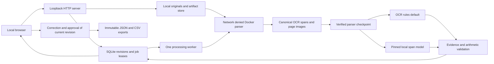

# Document Intelligence Workbench system card

This local invoice application turns bounded documents into evidence-linked suggestions, then requires a person to review and approve an exact revision before export. It is an experimental portfolio project. The main engineering result is the auditable workflow; extraction performance is specific to the measured datasets. See the [data card](data-card.md), [release runbook](portfolio-release.md), and original [architecture plan](../arch_plan/document-intelligence-workbench-plan.md).

## Implemented architecture

The current stack uses Python 3.12 standard-library HTTP and SQLite, a no-build HTML/CSS/JavaScript interface, Poppler/Tesseract in Docker, and optional native llama.cpp inference. FastAPI, React, a telemetry stack, and PC inference from the plan are not implemented. This smaller local stack demonstrates the processing/review contract independently of a framework migration.

| Boundary | Implemented control | Practical limit |
|---|---|---|
| Upload | Allowed PDF/PNG/JPEG types, signature checks, 20 MiB originals, 20 million image pixels, ten PDF pages, artifact quota | These bounds are not a parser exploit audit or a measured concurrent capacity |
| Parser | Immutable local image ID; no network, read-only root/original, user 65534, no capabilities, two CPUs, 1 GiB memory, 64 PIDs, 600-second deadline | Docker host and local OS remain trusted; timeout/OOM drills use deliberately reduced limits |
| Parser import | Expected file inventory, checksums, canonical page/span contracts, coordinate and raster dimensions | OCR line boxes describe source regions, not exact semantic field boxes |
| Model | Explicit hash-pinned downloads; authenticated loopback server; source spans and boxes supplied as document data | The model can suggest incorrect values and evidence. Existence/alignment checks do not establish semantic truth |
| Review | New revisions preserve original suggestions, optimistic revision checks, issue decisions with reasons | Reviewer labels are unauthenticated audit labels |
| Export | Current revision approval, record/approval hashes, immutable JSON/CSV bytes, spreadsheet formula escaping | Export approval does not establish invoice authenticity or business correctness |
| Browser | Loopback binding, ephemeral session cookie, same-origin mutation checks, authenticated page/export delivery | Local single-user prototype; no verified identity, roles, or multi-user deployment claim |

The deterministic default is `ocr_rules` v0.3. `spatial_rules` remains opt-in after a calibration regression. The optional model profile pins Qwen3-4B-Instruct-2507 Q4_K_M and llama.cpp; exact identities and settings live in [the configuration](../config/model-mac-instruct.json). Models cannot approve records or export them. [The comparison policy](release-evaluation.md) keeps test results separate from tuning and default promotion.

## Provenance and recovery

Each observed field refers to canonical OCR span IDs. The server validates reference existence and value alignment; selecting a field navigates to its page and highlights its line region. Corrections retain the original suggestion and evidence while marking reviewer origin. Missing or unsupported evidence remains a review concern. Arithmetic uses decimal values and preserves printed totals when they disagree with computed values. Missing components leave the check incomplete.

SQLite stores revisions, extraction metadata, issue decisions, approvals, exports, and durable jobs. Processing claims have renewable leases and fencing tokens so an expired worker cannot publish over a reclaimed job. A hash-verified parser checkpoint binds original bytes, the immutable parser image, and host contracts, allowing extraction retries without another parser invocation.

[Portable backups](intake.md#portable-backup-and-restoration) snapshot SQLite and referenced artifacts. Restoration verifies the inventory, preserves approved export bytes, and requeues interrupted jobs with new fencing tokens. [Recorded live drills](parser-resources.md) exercise parser timeout/OOM, scratch/container cleanup, retries, abrupt host worker exit, and backup restoration. These are observed local recovery cases; power loss, every interruption point, and cross-version migration remain unverified.

## Measured behavior

The [frozen synthetic invoice baseline](invoice-heldout-run.md) covers 180/180 test documents: header macro F1 0.9981, all required fields exact on 163/166 eligible documents, and exact-row F1 0.9423. That evaluation uses trusted PNG previews and excludes production PDF rendering. The [real-model HTTP workflow](real-model-upload.md) covers two fictional PNG uploads through Docker, correction, approval, and downloads; it is integration evidence, not held-out quality.

On the recorded Apple M1 / 16 GiB host, those two model workflows took 66.396 and 57.521 seconds after server readiness. Recorded offload was 37/37 layers and peak sampled server RSS was about 3.57 GiB. These observations do not establish controlled warm latency, GPU allocation, or total application memory. The complete held-out invoice model and CORD comparisons are pending; the [release audit](portfolio-release.md#generate-the-release-audit) never scores partial inference.

## Data handling and known limits

Originals, rendered pages, OCR, candidate values, review history, exports, and optional model diagnostics reside on local disk. Model processing uses the configured loopback server; setup downloads are explicit. Runtime parsing has no cloud fallback. Local disk encryption is an OS responsibility. Backup copies and downloaded exports have separate retention; automatic retention and complete document deletion are not implemented.

The system does not perform payment decisions, bank-account checks, invoice authenticity checks, tax advice, handwriting recognition, purchase-order matching, or unattended approval. English OCR and narrow amount/date conventions limit language and layout coverage. The [scripted Chrome demonstration](browser-verification.md) verifies rotation/highlight alignment, multiple pages, keyboard controls, and export downloads on declared fictional fixtures. Genuine scanner-captured invoices, semantic evidence attribution sampling, a bounded 20-document performance study, and human review results remain release work. The audit is a portfolio evidence checklist, not exhaustive architecture acceptance or production certification.
