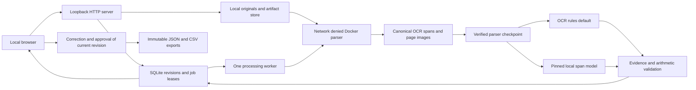

# Document Intelligence Workbench system card

This local invoice application turns bounded documents into evidence-linked suggestions, then requires a person to review and approve an exact revision before export. It is an experimental portfolio project. The main engineering result is the auditable workflow; extraction performance is specific to the measured datasets. See the [data card](data-card.md), [release runbook](portfolio-release.md), and original [architecture plan](../arch_plan/document-intelligence-workbench-plan.md).

## Implemented architecture

This card describes the published experimental implementation. The [v1 release contract](v1-release-contract.md) defines future mandatory capabilities and evidence; the [backlog](backlog.md) records their status. [ADR 0001](adr/0001-local-v1-scope.md) reconciles the original design with the chosen local v1 stack. Planned controls must not be read as implemented controls in this card.

The current stack uses Python 3.12 standard-library HTTP and SQLite, a no-build HTML/CSS/JavaScript interface, Poppler/Tesseract in Docker, and optional native llama.cpp inference. FastAPI, React, a telemetry stack, and PC inference from the plan are not implemented. This smaller local stack demonstrates the processing/review contract independently of a framework migration.

`make demo-replay` provides an [offline portfolio entrypoint](demo-replay.md) with four recorded fictional development candidates. It verifies saved evidence before preparing a separate workbench; correction, approval, and export use the normal durable stores. Replay provenance remains visible in the UI and JSON exports. No parser, OCR, model, or human-timing measurement runs in this mode.

| Boundary | Implemented control | Practical limit |
|---|---|---|
| Upload | Allowed PDF/PNG/JPEG types, signature checks, 20 MiB originals, 20 million image pixels, ten PDF pages, artifact quota | These bounds are not a parser exploit audit or a measured concurrent capacity |
| Parser | Immutable local image ID; no network, read-only root/original, user 65534, no capabilities, two CPUs, 1 GiB memory, 64 PIDs, 600-second deadline | Docker host and local OS remain trusted; timeout/OOM drills use deliberately reduced limits |
| Parser import | Expected file inventory, checksums, canonical page/span contracts, coordinate and raster dimensions | OCR line boxes describe source regions, not exact semantic field boxes |
| Model | Explicit hash-pinned downloads; authenticated loopback server; source spans and boxes supplied as document data | The model can suggest incorrect values and evidence. Existence/alignment checks do not establish semantic truth |
| Review | New revisions preserve original suggestions, optimistic revision checks, issue decisions with reasons | Reviewer labels are unauthenticated audit labels |
| Export | Current revision approval, record/approval hashes, immutable JSON/CSV bytes, spreadsheet formula escaping | Export approval does not establish invoice authenticity or business correctness |
| Browser | Loopback binding, ephemeral session cookie, same-origin mutation checks, authenticated page/export delivery | Local single-user prototype; no verified identity, roles, or multi-user deployment claim |

The deterministic default is `ocr_rules` v0.3. `spatial_rules` remains opt-in after a calibration regression. The optional model profile pins Qwen3-4B-Instruct-2507 Q4_K_M and llama.cpp; exact identities and settings live in [the configuration](../config/model-mac-instruct.json). Models cannot approve records or export them. [The comparison policy](release-evaluation.md) keeps test results separate from tuning and default promotion.

## Current working-source reviewer authority

B03 adds [local reviewer capabilities](access.md) to the working source. Browser review actors come from the server OS account; forged actor requests and processing/model credentials cannot authorize review. Page/export reads require reviewer permission. The browser displays the established identity read-only. CLI labels remain trusted-operator audit labels, and historical approvals/results are unchanged. These local capabilities do not establish multi-user isolation or independently identify a person. The table above describes the published experimental boundary; final-v1 acceptance remains pending.

## Provenance and recovery

Each observed field refers to canonical OCR span IDs. The server validates reference existence and value alignment; selecting a field navigates to its page and highlights its line region. Corrections retain the original suggestion and evidence while marking reviewer origin. Missing or unsupported evidence remains a review concern. Arithmetic uses decimal values and preserves printed totals when they disagree with computed values. Missing components leave the check incomplete.

SQLite stores revisions, extraction metadata, issue decisions, approvals, exports, and durable jobs. Processing claims have renewable leases and fencing tokens so an expired worker cannot publish over a reclaimed job. A hash-verified parser checkpoint binds original bytes, the immutable parser image, and host contracts, allowing extraction retries without another parser invocation.

[Portable backups](intake.md#portable-backup-and-restoration) snapshot SQLite and referenced artifacts. Restoration verifies the inventory, preserves approved export bytes, and requeues interrupted jobs with new fencing tokens. [Recorded live drills](parser-resources.md) exercise parser timeout/OOM, scratch/container cleanup, retries, abrupt host worker exit, and backup restoration. These are observed local recovery cases; power loss, every interruption point, and cross-version migration remain unverified.

## Measured behavior

The [frozen synthetic invoice baseline](invoice-heldout-run.md) covers 180/180 test documents: header macro F1 0.9981, all required fields exact on 163/166 eligible documents, and exact-row F1 0.9423. The [completed paired model experiment](heldout-model-comparison.md) accounts for the same 180 documents, including four failed extractions: model header macro F1 is 0.9766 and exact-row F1 is 0.7985. The predeclared regression gate rejects promotion, and rules remain the default. This comparison uses trusted PNG previews and saved OCR; it excludes production PDF rendering.

The separate 100-receipt CORD test comparison records rules/model total F1 0.2435/0.1651 and eligible exact-row F1 0.0957/0.0204. Five model failures remain in the denominators. Both variants show a substantial domain gap for this English-OCR adapter; receipt row/amount labels are narrower than the full CORD task. The [standalone comparison](../evals/release-comparison-2026-10-03.html) presents uncertainty, failure examples and timing boundaries.

The [real-model HTTP workflow](real-model-upload.md) covers two fictional PNG uploads through Docker, correction, approval, and downloads; it is integration evidence, not held-out quality. The [candidate refresh](../evals/portfolio-candidate-model-workflow-2026-10-03/report.json) records the current source separately from the original measurement.

On the recorded Apple M1 / 16 GiB host, the original two model workflows took 66.396 and 57.521 seconds after server readiness. Recorded offload was 37/37 layers and peak sampled server RSS was about 3.57 GiB. These historical observations do not establish controlled warm latency, GPU allocation, or total application memory. Held-out model stage P50/P95 are 102.645/162.536 seconds per invoice and 30.394/125.236 seconds per receipt. Multi-page and repair requests can contribute to one document stage. Machine load was uncontrolled, and an interrupted invoice session lacks RSS/shutdown metadata; sampled memory cannot establish a whole-run invoice peak. The [release audit](portfolio-release.md#generate-the-release-audit) verifies complete comparisons without scoring partial inference.

## Data handling and known limits

Originals, rendered pages, OCR, candidate values, review history, exports, and optional model diagnostics reside on local disk. Model processing uses the configured loopback server; setup downloads are explicit. Runtime parsing has no cloud fallback. Local disk encryption is an OS responsibility. The [lifecycle runbook](lifecycle.md) covers automatic serial processing, tracked local deletion and the persisted 20 GiB artifact growth budget with a 256 MiB disk reserve. Shared references survive deletion until their last owner is removed. This is logical deletion, not forensic erasure; backup copies, archived evidence and downloaded exports have separate retention. Automatic age-based retention remains outside this implementation.

The system does not perform payment decisions, bank-account checks, invoice authenticity checks, tax advice, handwriting recognition, purchase-order matching, or unattended approval. English OCR and narrow amount/date conventions limit language and layout coverage. The [scripted Chrome demonstration](browser-verification.md) verifies rotation/highlight alignment, multiple pages, keyboard controls, and export downloads on declared fictional fixtures. The [20-document production parser queue](parser-queue.md) measures serial OCR/rules processing of development PNG/PDF originals; it excludes model inference, quality scoring, and controlled warm/cold or concurrent capacity. The [completed author pilot](review-pilot.md#recorded-author-results) has six approved/exported trials, active median 62.459 seconds, required headers exact on 5/6 documents and exact rows on 19/20. The retained invoice-number and description errors demonstrate that approval is not proof of correctness. The pilot uses one author, fixed synthetic development cases and recorded OCR; it cannot support time saved or independent workforce claims. Genuine scanner-captured invoices, semantic evidence attribution sampling and controlled performance/memory studies are explicitly deferred from the [experimental release](portfolio-candidate.md). The audit is a portfolio evidence checklist, not exhaustive architecture acceptance or production certification.

[Post-pilot corrections](post-pilot-corrections.md) demonstrate approval invalidation after maintenance: two new drafts retain historical records and require fresh human approval before export. Their diagnostic scores do not replace the measured author results.
